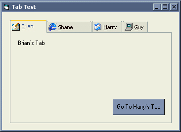



## xpWellsTab

### Description

Lots of people including me, have or still are, creating custom controls that emulate the look and feel of Windows XP. To some this may seem as a waste of time because a Manifest will do all the hard work for you and repaint the boring normal controls in the new XP look. However so many client machines don't have XP yet and if someone has made these XP style of controls for you then why not use them. Also if you want to use a Progress Bar, Status Bar or Tab Strip control you still have to carry around that Comctrl32.ocx which almost every Vb`er hates.

If its a Tab Strip control you are looking for, then I hope this one is good enough for you to freely use in any of your projects. The control is far from being perfect and future enhancements will be made when I have the time.

Enjoy
 
### More Info
 

             |
---                |---
**Submitted On**   |2003-02-08 23:01:16
**By**             |[Richard Wells](https://github.com/Planet-Source-Code/PSCIndex/blob/master/ByAuthor/richard-wells.md)
**Level**          |Advanced
**User Rating**    |5.0 (60 globes from 12 users)
**Compatibility**  |VB 5\.0, VB 6\.0
**Category**       |[Custom Controls/ Forms/  Menus](https://github.com/Planet-Source-Code/PSCIndex/blob/master/ByCategory/custom-controls-forms-menus__1-4.md)
**World**          |[Visual Basic](https://github.com/Planet-Source-Code/PSCIndex/blob/master/ByWorld/visual-basic.md)
**Archive File**   |[xpWellsTab1566243292003\.zip](https://github.com/Planet-Source-Code/richard-wells-xpwellstab__1-44353/archive/master.zip)

